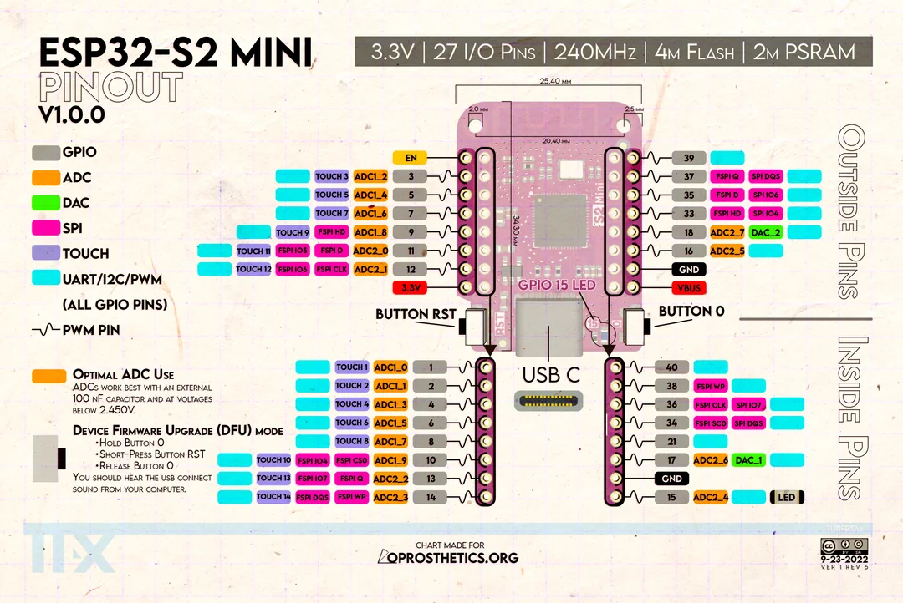
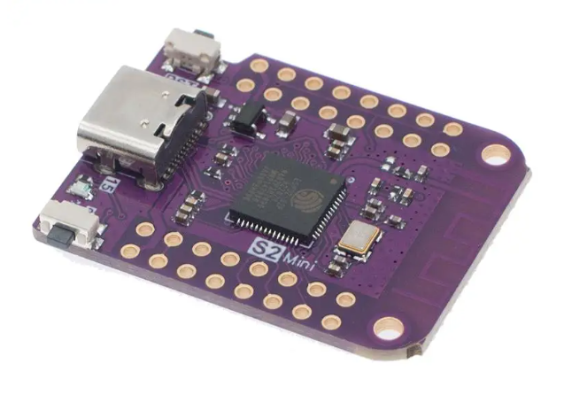
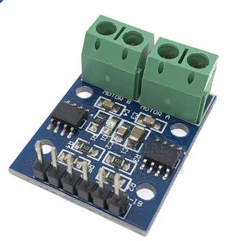
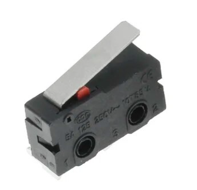
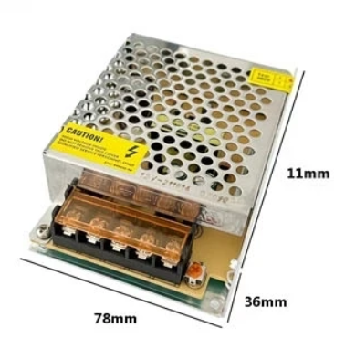
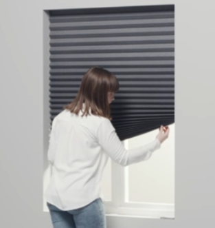
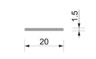
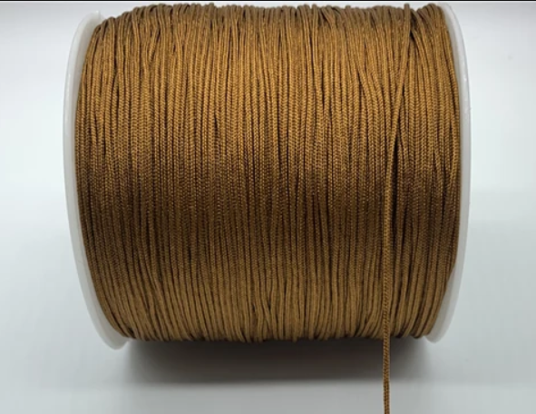
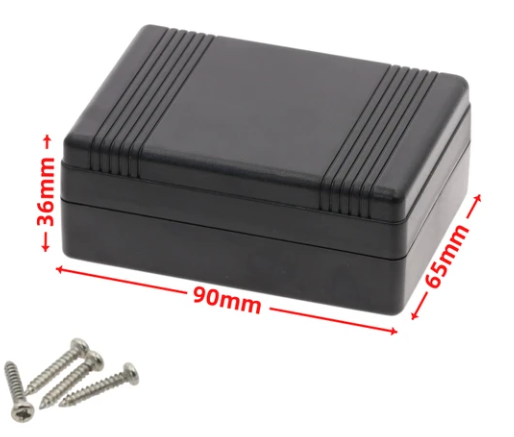
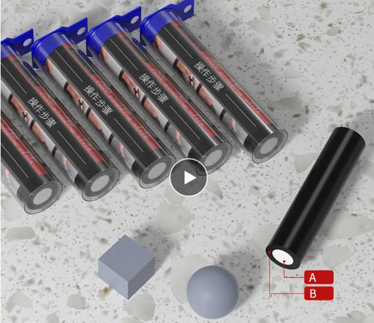

# tasmota-blind

tasmota-blind

## berry script

https://tasmota.github.io/docs/Berry/

---

https://tasmota.github.io/docs/Buttons-and-Switches/#rules

SetOption73 1;

Backlog ButtonMode 1;
ButtonTopic 0;
Backlog Rule1 on Button1#state do Publish stat/custom-topic/BUTTON1 %value% endon;
Rule1 1;
Restart 1;

---

## tasmota template

https://github.com/berry-lang/berry/wiki/Chapter-7#math-module

https://github.com/berry-lang/berry

https://github.com/arendst/Tasmota/blob/development/tasmota/berry/examples/web_handler_demo.be

https://github.com/arendst/Tasmota/blob/development/tasmota/berry/gpio_viewer/debug_panel.be

## S2 mini

https://www.wemos.cc/en/latest/s2/s2_mini.html#pin

## COMPONENTS

| Component                | Price      | Link                                                                                    | Image                                               |
| ------------------------ | ---------- | --------------------------------------------------------------------------------------- | --------------------------------------------------- |
| Micro-controller esp32s2 | 0,99€      | [aliexpress](https://es.aliexpress.com/item/1005006469381084.html)                      | {height=60} |
| Voltage regulator        | 0,46€      | [aliexpress](https://es.aliexpress.com/item/1005005870392716.html)                      | {height=60}        |
| Motor controller HG7881  | 0,99€      | [aliexpress](https://es.aliexpress.com/item/1005006126762079.html)                      | {height=60}  |
| Micro switcher           | 0,95€      | [aliexpress](https://es.aliexpress.com/item/1005003536527857.html)                      | {height=60}           |
| Rotor 200RPM 12V         | 2,29€      | [aliexpress](https://es.aliexpress.com/item/1005004045108485.html)                      | {height=60}         |
| Power supply 5A 12V      | 4,43€      | [aliexpress](https://es.aliexpress.com/item/1005005626231303.html)                      | {height=60}     |
| Blockout pleated blink   | 6,99€      | [IKEA](https://www.ikea.com/es/es/p/schottis-estor-plisado-opaco-gris-oscuro-90369507/) | {height=60}     |
| Aluminum profile         | 1,88€      | [manomano](https://www.manomano.es/p/pa-24801490)                                       | {height=60}      |
| Nylon rope 1mm           | 1,84€      | [aliexpress](https://es.aliexpress.com/item/1005001826069499.html)                      | {height=60}    |
| Case                     | 1,90€      | [aliexpress](https://es.aliexpress.com/item/1005002656761229.html)                      | {height=60}                    |
| Epoxy paste              | 3,10€      | [aliexpress](https://es.aliexpress.com/item/1005006124394766.html)                      | {height=60}             |
| Total:                   | **25,82€** |                                                                                         |                                                     |

## Copilot helped me

... my question was:

#### Given my 12V power supply rated at 5A, how many 12V motors (each drawing 0.34A) and ESP32 devices (each drawing approximately 0.1A) can I connect?

... copilot answered:

#### With a 12V power supply rated at 5A, we can calculate how many 12V motors (each drawing 0.34A) and ESP32 devices (each drawing approximately 0.1A) you can connect. Here’s the breakdown:

- Total current per device:
  - Motor: **0.34A**
  - ESP32: Approximately **0.1A**
- Total current per device:
  - **0.34A (motor) + 0.1A (ESP32) = 0.44A**
- Maximum number of motors and ESP32 devices:
  - The power supply provides a total of **5A**.
  - Divide the total power supply current by the total current per device:
  - **5A / 0.44A ≈ 11**
  - Therefore, you can connect up to **11 motors** and **11 ESP32 devices** to your power supply.
