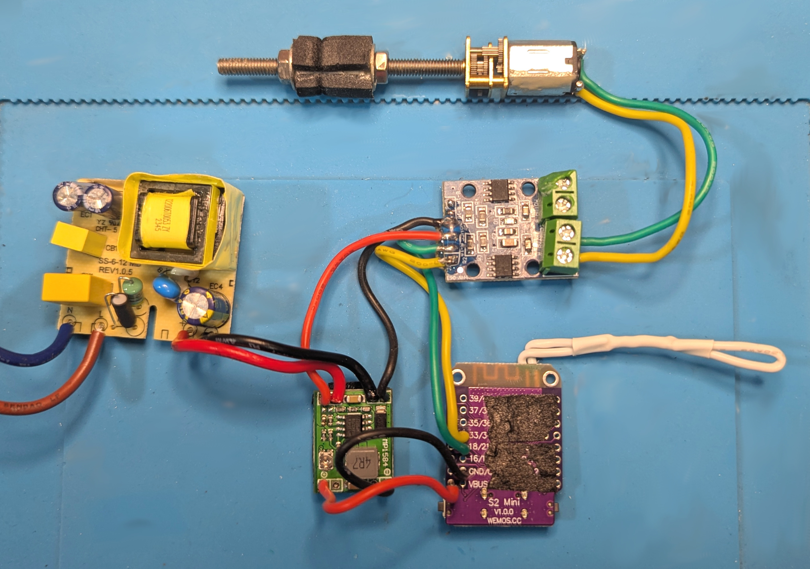
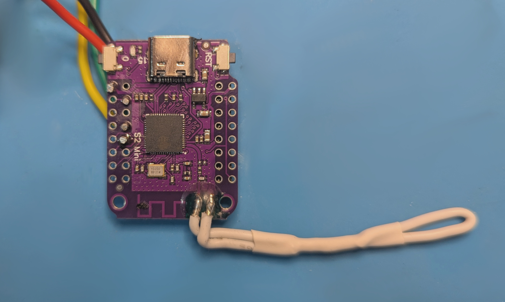
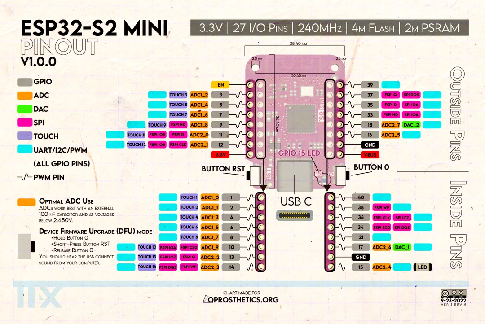
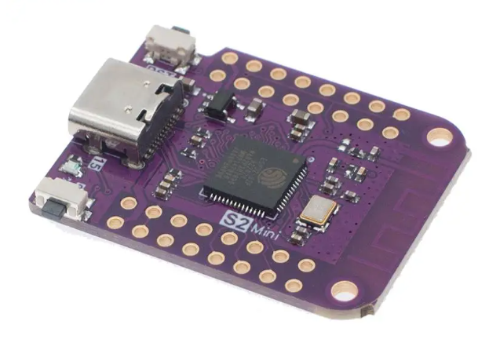
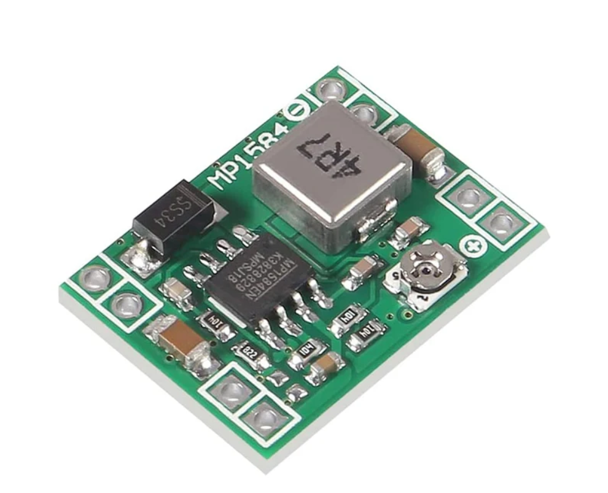
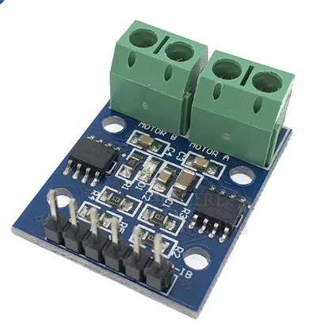
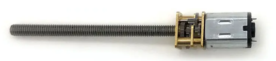
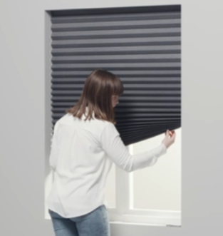
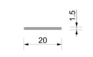
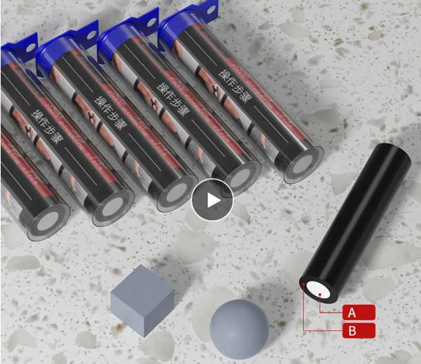

# tasmota IKEA-SCHOTTIS-BLIND

IoT blind software and hardware development based on Tasmota.

### flash to tasmota32

- https://tasmota.github.io/docs/ESP32/#esp32-s2
- https://tasmota.github.io/docs/ESP32/#flashing
- https://tasmota.github.io/install/
- https://tasmota.github.io/docs/Blinds-and-Shutters
- https://tasmota.github.io/docs/Commands/#shutters
- https://tasmota.github.io/docs/PWM-dimmer-switch/#pwm-dimmer-operation

## Schema

Set the voltage regulator to 3.6V

## Increase wifi signal

## S2 mini

https://www.wemos.cc/en/latest/s2/s2_mini.html#pin

## COMPONENTS

| Component                | Link                                                                                    | Image                                                  |
| ------------------------ | --------------------------------------------------------------------------------------- | ------------------------------------------------------ |
| Micro-controller esp32s2 | [aliexpress](https://es.aliexpress.com/item/1005006469381084.html)                      |  |
| Voltage regulator        | [aliexpress](https://es.aliexpress.com/item/1005005870392716.html)                      |         |
| Motor controller HG7881  | [aliexpress](https://es.aliexpress.com/item/1005006126762079.html)                      |   |
| Rotor 200RPM 12V         | [aliexpress](https://es.aliexpress.com/item/1005004045108485.html)                      |          |
| Power supply 5A 12V      | [aliexpress](https://es.aliexpress.com/item/1005005626231303.html)                      |      |
| Blockout pleated blink   | [IKEA](https://www.ikea.com/es/es/p/schottis-estor-plisado-opaco-gris-oscuro-90369507/) |      |
| Aluminum profile         | [manomano](https://www.manomano.es/p/pa-24801490)                                       |       |
| Nylon rope 1mm           | [aliexpress](https://es.aliexpress.com/item/1005001826069499.html)                      |     |
| Case                     | [aliexpress](https://es.aliexpress.com/item/1005002656761229.html)                      |                     |
| Epoxy paste              | [aliexpress](https://es.aliexpress.com/item/1005006124394766.html)                      |              |

## Copilot helped me

... my question was:

**Given my 12V power supply rated at 5A, how many 12V motors (each drawing 0.34A) and ESP32 devices (each drawing approximately 0.1A) can I connect?**

... copilot answered:

**With a 12V power supply rated at 5A, we can calculate how many 12V motors (each drawing 0.34A) and ESP32 devices (each drawing approximately 0.1A) you can connect. Here’s the breakdown:**

- Total current per device:
  - Motor: **0.34A**
  - ESP32: Approximately **0.1A**
- Total current per device:
  - **0.34A (motor) + 0.1A (ESP32) = 0.44A**
- Maximum number of motors and ESP32 devices:
  - The power supply provides a total of **5A**.
  - Divide the total power supply current by the total current per device:
  - **5A / 0.44A ≈ 11**
  - Therefore, you can connect up to **11 motors** and **11 ESP32 devices** to your power supply.
